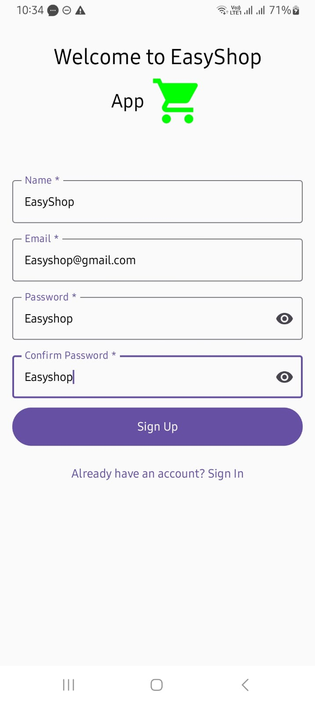
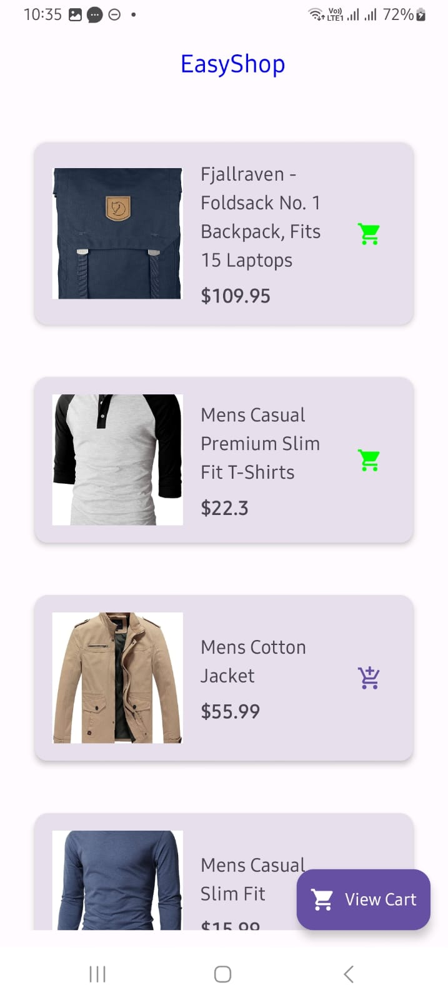
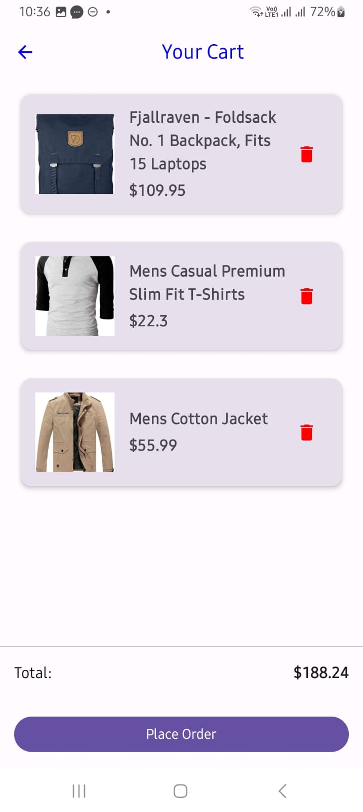
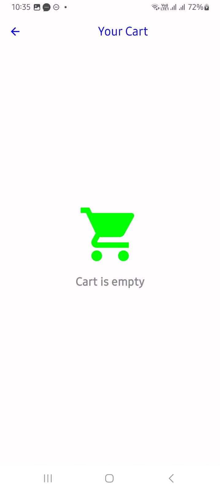
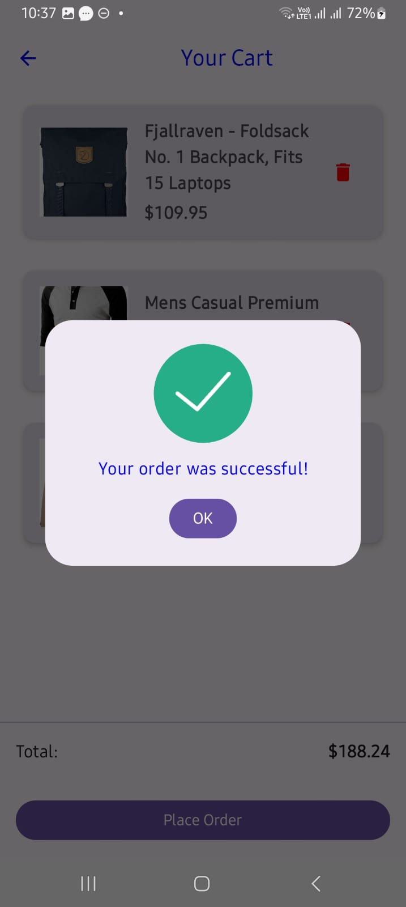

# Easy-Shop

## Overview
EasyShop is a modular e-commerce Android application built with Kotlin and Jetpack Compose. It allows users to browse products, add items to a cart and place orders efficiently.

### Features:
- Authenticate users for sign-in and sign-up using Firebase.
- Browse products available in the [store](https://fakestoreapi.com/products).
- Add products to the cart.
- Delete a product from the cart.
- Get the total amount from the cart.
- Place an order after adding items to the cart.

## Tech stack
- Networking: [Retrofit](https://github.com/square/retrofit), [OkHttp](https://square.github.io/okhttp/)
- JSON Serialization: [Gson](https://github.com/google/gson)
- UI: [Jetpack Compose](https://developer.android.com/jetpack/compose), [Material3](https://m3.material.io/)
- Image Loading: [Coil](https://github.com/coil-kt/coil)
- Dependency Injection: [Hilt](https://developer.android.com/training/dependency-injection/hilt-android)
- Coroutines: [Kotlin Coroutines](https://github.com/Kotlin/kotlinx.coroutines)
- Flows: [Flows](https://kotlinlang.org/docs/flow.html)
- Logging: [Timber](https://github.com/JakeWharton/timber)
- Static Analysis: [Detekt](https://github.com/detekt/detekt), [Ktlint](https://github.com/pinterest/ktlint), [Spotless](https://github.com/diffplug/spotless)
- App Authentication: [Firebase SDK](https://firebase.google.com/)
- Local Storage: [Room](https://developer.android.com/training/data-storage/room), [Cipher](https://github.com/oblador/cipher)
- Testing: [JUnit 4](https://junit.org/junit4/), [Turbine](https://github.com/cashapp/turbine), [Mockk](https://mockk.io/), [MockWebServer](https://github.com/square/okhttp/tree/master/mockwebserver)
- API Debugging: [Chucker](https://github.com/ChuckerTeam/chucker)
- Performance & Analytics:
    - [Firebase Analytics](https://firebase.google.com/docs/analytics) (Active users tracking)
    - [Firebase Performance](https://firebase.google.com/docs/perf-mon) (Network requests & app start time)
    - [Firebase Crashlytics](https://firebase.google.com/docs/crashlytics) (App Crashes)
- Build Optimization: [R8](https://developer.android.com/studio/build/shrink-code)
- CI/CD: [GitHub Actions](https://github.com/features/actions)

## Screenshots

  

  

